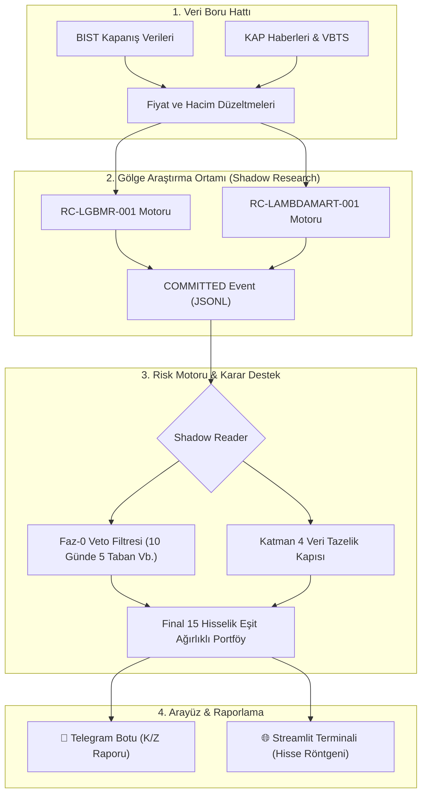

# BIST Quant: Gölge Mimari & Karar Destek Sistemi

[](https://www.python.org/downloads/)
[](https://lightgbm.readthedocs.io/)
[](https://streamlit.io/)
[-orange.svg)](https://www.borsaistanbul.com/)
[](LICENSE)
[](#)

> ⚠️ **YASAL UYARI VE KURUMSAL SINIRLAR:**  
> Bu yazılım; Borsa İstanbul pay piyasasında işlem gören hisse senetleri için geliştirilmiş **kantitatif bir araştırma, simülasyon ve Karar Destek Sistemidir (Decision Support System - DSS)**.  
> Sistem **kesinlikle otomatik emir iletmez, canlı sermaye yönetmez ve hiçbir aracı kurum API'sine doğrudan bağlı değildir**.  

---

## 📌 Sistem Özeti

BIST Quant, geleneksel fiyat tahmini algoritmalarının aksine **Kesitsel Sıralama (Learning-to-Rank)** ve **İleri Yönlü Gölge Altyapı (Forward Shadow Infrastructure)** prensipleriyle çalışan kurumsal düzeyde bir sistemdir.

Son **EXP-MODEL-001** testlerinden geçen Şampiyon modeller:
1. 🥇 **RC-LGBMR-001 (LightGBM Regression):** Birincil Yürütücü Model.
2. 🥈 **RC-LAMBDAMART-001 (LambdaMART):** İkincil Model.

---

## 🏗️ Sistem Mimarisi ve Uçtan Uca Akış

Sistem, geleneksel monolitik yapıyı terk ederek, araştırma ve üretimi tamamen izole eden **"Shadow System"** mimarisi üzerinde çalışır:



### 🧬 Şampiyon Modeller

- **RC-LGBMR-001 (Primary):** `max_depth: 4`, `num_leaves: 15` gibi parametrelerle donatılmış, aşırı uyum (overfitting) riskini ortadan kaldıran sığ regresyon mimarisi.
- **RC-LAMBDAMART-001 (Secondary):** İkili kıyas (pairwise) algoritmalarıyla hisseleri birbirleriyle doğrudan rekabet ettirerek en güçlülerini tepeye taşıyan sıralama modeli.
- **Sıfır Geleceğe Bakma Hatası (Zero Lookahead Bias):** Modeller sadece Point-in-Time (PIT) veriler üzerinden katı kilit kutu (lockbox) protokolleriyle eğitilir. 

---

## 🛡️ Güvenlik ve Risk Yönetimi

- **Katman 4 Tazelik Kapısı:** Son fiyat veya makro veriler $\ge 2$ gün bayatsa, sistem otomatik kilitlenir.
- **Faz-0 (PASEU) Doktrini:** Son 10 işlem gününde 5 defa taban çeken hisseler doğrudan veto edilir.
- **%25 Devre Kesici:** Portföy tarihi tepesinden %25 gerilerse sistem tamamen nakde geçer.
- **Lockbox (Kilit Kutu) Testi:** Yeni modeller 15 aylık out-of-sample kilit kutuda Sharpe oranı, p-değeri ve piyasa getirisi hedeflerini aşamazsa direkt elenir.

---

## 🌐 Streamlit Terminali (Bloomberg Grid)

`python main.py panel` komutuyla açılan yönetim terminali 5 sekmeden oluşur:

1. **💼 Canlı Portföy:** 15 hissenin güncel durumu ve kâr/zararı.
2. **🏆 Otonom Model Sıralaması:** RC-LGBMR-001 ve RC-LAMBDAMART-001 sonuçlarının karşılaştırmalı tablosu.
3. **🛡️ Sistem Sağlığı & Drift Radarı:** Tazelik kapısı ve NaN taraması.
4. **👤 Gerçek Portföyüm:** Otonom sistemden %100 izole kişisel portföy yönetimi.
5. **🔍 Hisse Röntgeni (Stock X-Ray 2.0):** Seçilen hissenin model sırası, BIST 100 görece alfası ve risk profillerini detaylandıran klinik panel.

---

## ⚙️ Hızlı Kurulum

```bash
git clone https://github.com/emreerbasli/bist-quant-ranking.git
cd bist-quant-ranking

# Sanal ortamı kur ve aktifleştir
python -m venv venv
venv\Scripts\activate

# Gerekli kütüphaneleri yükle
pip install -r requirements.txt
```

Merkezi konsol komutları (`python main.py`):
* `panel`: Streamlit Yönetim Panelini açar.
* `guncelle`: Günlük BIST kapanış verilerini çeker.
* `kontrol`: Gölge sinyalleri tarar ve Telegram'a rapor atar.
* `dogrula`: Veri bütünlüğünü denetler.

---

## 🛑 Reddedilen Yaklaşımlar (Kurumsal Hafıza)

| Fikir | Test | Sonuç |
|:---|:---|:---|
| **Sabit Stop-Loss (TP/SL)** | 25 farklı marj denemesi | Piyasa oynaklığı nedeniyle "silkeleme" kurbanı oldu, Sharpe çöktü. |
| **Aylık Rotasyon** | 20 günde bir kurulum | Yıllık turnover %400'ü aştı, komisyon/spread maliyetleri alfanın tamamını sildi. |
| **Canlı Broker API** | Aracı kuruma otomatik emir | Regülasyon ve piyasa makas boşlukları nedeniyle iptal edildi. |
