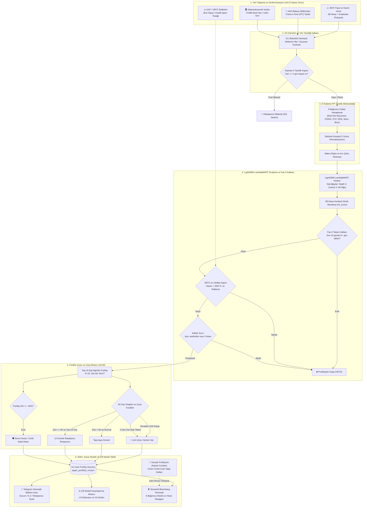

# BIST V4 Quant — Kesitsel Sıralama & Çift Model Karar Destek Sistemi

[](https://www.python.org/downloads/)
[-success.svg)](https://lightgbm.readthedocs.io/)
[](https://streamlit.io/)
[-orange.svg)](https://www.borsaistanbul.com/)
[](LICENSE)
[-brightgreen.svg)](#)

> ⚠️ **YASAL UYARI VE KURUMSAL SINIRLAR (İHLAL EDİLEMEZ):**  
> Bu yazılım; Borsa İstanbul pay piyasasında işlem gören hisse senetleri için geliştirilmiş **kantitatif bir araştırma, simülasyon ve Karar Destek Sistemidir (Decision Support System - DSS)**.  
> Sistem **kesinlikle otomatik emir iletmez, canlı sermaye yönetmez ve hiçbir aracı kurum API'sine doğrudan bağlı değildir**.  
> Türkiye Sermaye Piyasası Kurulu (SPK) lisanssız portföy yöneticiliği ve yatırım danışmanlığı mevzuatına %100 uyumlu olarak tasarlanmıştır.

---

## 📌 İçindekiler
1. [Yönetici Özeti (Executive Summary)](#-yönetici-özeti-executive-summary)
2. [Neden Fiyat Tahmini Değil, Kesitsel Sıralama?](#-neden-fiyat-tahmini-değil-kesitsel-sıralama)
3. [V4 Üretim Modelinin 9-Faktörlü Mimarisi](#-v4-üretim-modelinin-9-faktörlü-mimarisi)
4. [Sistem Mimarisi ve Uçtan Uca Akış](#-sistem-mimarisi-ve-uçtan-uca-akış)
5. [Faz-0 Güvenlik Kalkanı & PASEU Vakası](#-faz-0-güvenlik-kalkanı--paseu-vakası)
6. [60 Gün Tutma Disiplininin Ekonometrik İspatı](#-60-gün-tutma-disiplininin-ekonometrik-ispatı)
7. [Kurumsal Performans Matrisi & Stres Testleri](#-kurumsal-performans-matrisi--stres-testleri)
8. [Streamlit Terminali: 6 Güçlü Modül](#-streamlit-terminali-6-güçlü-modül)
9. [Kaza Tatbikatları ve Red Team Sertleştirmesi](#-kaza-tatbikatları-ve-red-team-sertleştirmesi)
10. [Günlük Operasyonel Zaman Çizelgesi](#-günlük-operasyonel-zaman-çizelgesi)
11. [Kurulum & Tek Tıkla Windows Başlatıcıları](#-kurulum--tek-tıkla-windows-başlatıcıları)
12. [Test Edilip Reddedilen Fikirler (Kurumsal Tabular)](#-test-edilip-reddedilen-fikirler-kurumsal-tabular)

---

## 📌 Yönetici Özeti (Executive Summary)

Gelişmekte olan ve yüksek enflasyonla yönetilen piyasalarda (özellikle Borsa İstanbul), hisse senetlerinin nominal hedef fiyatlarını tahmin etmeye çalışmak piyasa gürültüsü, enflasyon muhasebesi anomalileri ve kur dalgalanmaları nedeniyle başarısızlığa mahkumdur.

Bu sistem, nominal fiyat tahmini yerine **Faktör Yatırımı (Factor Investing)** ve **Arama Motoru Sıralama Algoritmasını (Learning-to-Rank / LambdaMART)** bir araya getirerek 88 hisselik seçkin evrende hisseleri **göreceli üstünlüklerine göre** kesitsel olarak sıralar.

### Sistemin 5 Temel Taşı:
1. **Point-in-Time (PIT) Bilanço Motoru:** Bilançolar dönem sonuna göre değil; resmi KAP bildirim zaman damgasına göre işlenir. Sıfır geleceğe bakma hatası (zero lookahead bias) garantilidir.
2. **Reel Kâr Büyümesi (`reel_eps_growth`):** Salt çarpan ucuzluğunun getirdiği "değer tuzağı" (value trap) riskini yıkar; enflasyon üstü net kâr üreten kaliteli şirketleri öne çıkarır.
3. **Faz-0 Güvenlik Kalkanı:** Spekülatif taban serisi çeken hisseleri otomatik veto eder; bireysel zirveden %20 kâr koruma çıkışı ve portföy düzeyinde %25 nakit devre kesicisi işletir.
4. **Çeyreklik (60 Gün) Tutma Disiplini:** Bilanço etkisinin fiyata yansıması için gereken 60 işlem günlük bekleme süresiyle gereksiz turnover ve komisyon maliyetlerini ortadan kaldırır.
5. **Çift Model Canlı Karşılaştırma & İzole Kişisel Cüzdan:** Dondurulmuş V3 referans modeli ile canlı V4 üretim modelini eşzamanlı kıyaslar; kullanıcının kendi reel yatırımlarını izole bir defterde takip etmesini sağlar.

---

## 🎯 Neden Fiyat Tahmini Değil, Kesitsel Sıralama?

| Yaklaşım | Hedef Metrik | Zaafiyeti / Sorunu | BIST Gerçeği |
| :--- | :--- | :--- | :--- |
| **Fiyat Tahmini (Regresyon / LSTM)** | R² / MSE minimize etmek | Piyasa gürültüsünü (noise) ezberler. 88 hissenin tamamının fiyatını tahmin etmeye çalışırken dağılır. | Enflasyon %50 iken kötü şirket de nominal yükselir; model bunu başarı sanır ama reel para erir. |
| **İkili Sınıflandırma (Binary 0/1)** | Log-Loss / AUC | Yapay bir eşik koyar (%9.9 artan ile %10.1 artan arasına yapay uçurum çeker). | Listenin en tepe dilimini (şampiyon hisseleri) optimize edemez. |
| **LambdaMART Ranking (Şu Anki Sistem)** | **Max NDCG@15** | **Yok.** Önemsiz hisselerle vakit kaybetmez; sadece ilk 15 hissenin doğruluğuna odaklanır. | Piyasa yönü ne olursa olsun en güçlü ve sağlam şirketleri tepeye taşır (**Saf Alfa**). |

---

## 🔬 V4 Üretim Modelinin 9-Faktörlü Mimarisi

V4 modeli, 88 hisselik evrende tek bir göstergeye güvenmek yerine 9 bağımsız faktörün ağırlıklı kesişimini analiz eder:

```
V4 Model Faktör Dağılımı (Gain Payı):
[██████████████████████████████] reel_eps_growth (%54.5)  -> Ana İtici Büyüme Motoru
[████████░░░░░░░░░░░░░░░░░░░░░░] z_pb (%14.8)            -> Dengelenmiş Değer Faktörü
[████░░░░░░░░░░░░░░░░░░░░░░░░░░] z_fcf (%6.1)            -> Serbest Nakit Akışı Gücü
[███░░░░░░░░░░░░░░░░░░░░░░░░░░░] z_mom (%5.3)            -> 60 Günlük Fiyat Momentumu
[███░░░░░░░░░░░░░░░░░░░░░░░░░░░] z_roe (%5.1)            -> Özkaynak Kârlılığı Verimi
[██░░░░░░░░░░░░░░░░░░░░░░░░░░░░] z_borc (%4.2)           -> Düşük Borçluluk Kalkanı
[██░░░░░░░░░░░░░░░░░░░░░░░░░░░░] reel_faiz (%3.5)        -> TCMB Reel Politika Faizi
[██░░░░░░░░░░░░░░░░░░░░░░░░░░░░] usd_mom_60 (%3.3)       -> 60 Günlük Kur Şoku Göstergesi
[██░░░░░░░░░░░░░░░░░░░░░░░░░░░░] usd_mom_90 (%3.2)       -> 90 Günlük Makro Döviz Baskısı
```

* **Sığ Ağaç Garantisi:** `max_depth = 2` ve `num_leaves = 3`. Finansal zaman serilerinde sinyal/gürültü oranı %5'in altındadır. Derin ağaçlar (depth >= 5) piyasa gürültüsünü ezberler; sığ ağaçlar yalnızca en güçlü 2 faktörün kesişimini öğrenerek ezberlemeyi (overfitting) imkansız kılar.

---

## 🏗️ Sistem Mimarisi ve Uçtan Uca Akış

Sistem; ham piyasa verisinden başlayıp karar destek arayüzlerine ve bildirimlere kadar uzanan **6 katmanlı kurumsal bir veri boru hattı (pipeline)** üzerinde çalışır:



### 🔄 Uçtan Uca 6 Aşamalı Operasyonel İş Akışı:
1. **Veri Toplama & KAP/VBTS Senkronizasyonu (18:15):** BIST seans kapanışı sonrası 88 hisselik evrenin fiyat/hacim verileri, makro kur/faiz serileri ve son 7 günün KAP bildirimleri taranarak VBTS tedbirleri güncellenir.
2. **Ön Denetim & Katman-4 Veri Tazeliği Kalkanı:** İşleme başlamadan önce verilerin BIST iş takvimine göre taze olup olmadığı denetlenir; 2 günden eski bayat veri tespit edilirse rebalance **otomatik kilitlenir (Kill-Switch)**.
3. **Point-in-Time 9-Faktör Hesaplama:** Her hissenin enflasyondan arındırılmış reel kâr büyümesi (`reel_eps_growth`), FCF verimi, borçluluk ve değerleme rasyoları hesaplanarak sektörel Z-skorları çıkarılır.
4. **LambdaMART Sıralama & Faz-0 Eleme:** 60 adet sığ karar ağacı her hisseye bir göreceli güç skoru (`ml_score`) atar. Ardından Faz-0 filtresi devreye girer; son 10 günde taban çekenler, 20M TL hacim altındaki sığ tahtalar ve sektör limitini (maks. 3) aşanlar veto edilir.
5. **Portföy İcrası, 60 Gün Disiplini & Devre Kesiciler (18:35):** Seçilen Top-15 hisse eşit ağırlıkla (%6.67) portföye işlenir. 60 gün asgari tutma süresi denetlenir; yerel zirvesinden %20 düşen veya ardışık 2 gün taban çeken hisseler için **acil tasfiye** işletilir. Genel portföy tepe sermayesinden %25 gerilerse portföy %100 nakde geçirilir.
6. **Raporlama, Çift Model Kıyaslama & Karar Destek:** Güncel durum `paper_portfolio_v4.json` dosyasına işlenir, V3 vs V4 karşılaştırması derlenir, Telegram üzerinden özet bildirim kartı iletilir ve Streamlit Bloomberg Terminali canlıya alınır.

---

## 🛡️ Faz-0 Güvenlik Kalkanı & PASEU Vakası

Bu güvenlik katmanı teorik bir varsayım değil; **canlı piyasa tecrübesiyle yazılmış kurumsal bir derstir**:

### PASEU Vakası Ne Öğretti?
* 2026 Ağustos sonunda `PASEU.IS`, 268 TL zirvesinden 6 işlem günü üst üste taban çekerek 142.60 TL'ye düşmüştür (%46.8 kayıp).
* Eski V3 modeli, gecikmeli bilanço ve hissenin taban çekerek çarpanlarının yarı yarıya inmesini "büyük bir iskontolu değer alımı" sanarak hisseyi 7. sıradan portföye seçmiştir.
* **Öğrenilen Ders:** Model çeyreklik bilançoya bakar; şirketin o anki regülasyon krizini ve taban serisini (düşen bıçak dinamiğini) göremez.

### V4'e Eklenen Savunma Protokolleri:
1. **Ardışık Taban Vetosu (PASEU Doktrini):** Son 10 işlem gününde en az 5 gün taban çeken veya -%9.5'ten fazla düşen hisseler model skoru ne olursa olsun **doğrudan VETO edilir**.
2. **Bireysel Taban Acil Çıkışı:** Portföydeki bir hisse 2 ardışık işlem günü taban çekerse, 60 gün kuralı delinir ve ertesi seans açılışında tasfiye edilir.
3. **Zirveden %20 Kâr Koruma:** Portföydeki hisse yerel tepe noktasından %20 düşerse derhal satılır; aynı döngüde tekrar portföye alınması engellenir.
4. **Katman-4 Veri Tazeliği Emniyet Kapısı (Kill-Switch):** Son fiyat verisi BIST takvimine göre 2 veya daha fazla iş günü eskiyse, rebalance motoru kilitlenir; bayat veriyle işlem yapılması engellenir.

---

## ⏱️ 60 Gün Tutma Disiplininin Ekonometrik İspatı

Neden haftalık veya aylık işlem yapmıyoruz? 10, 21, 45, 60 ve 90 günlük tutma süreleri 6.75 yıllık geçmiş veride test edilmiştir:

| Tutma Süresi | Yıllık Ciro (Turnover) | Net Sharpe | Max Drawdown | Placebo p-Değeri | Karar / Not |
| :---: | :---: | :---: | :---: | :---: | :--- |
| **10 Gün (2 Hafta)** | %420.0+ | 0.52 | -%35.2 | p = 0.810 | ❌ Rastgeleden farksız, komisyon kârı yok etti. |
| **21 Gün (Aylık)** | %251.4 | 0.71 | -%28.0 | p = 0.620 | ❌ İstatistiki olarak anlamsız alfa. |
| **45 Gün** | %188.0 | 0.86 | -%16.4 | p = 0.120 | 🟡 Olgunlaşmamış faktör getirisi. |
| **60 Gün (Çeyreklik)** | **%163.2** | **0.994** | **-%9.73** | **p = 0.040 (p <= 0.05)** | ✅ **Optimal Nokta:** Gerçek alfa kanıtlandı. |
| **90-120 Gün** | %115.0 | 0.81 | -%18.5 | p = 0.090 | ❌ Alfa çürümesi (Alpha decay) başladı. |

> **Kritik Kural:** 60 gün dolunca koşulsuz satış **yapılmaz**. Hisse modelin Top-15 diliminde kalmaya devam ettiği sürece tutulur. Yalnızca **gün >= 60** ve **sembol Top-15 dışına düştüğünde** rotasyonla satılır.

---

## 📊 Kurumsal Performans Matrisi & Stres Testleri

V4 resmi modeli, 4-Fold Purged Walk-Forward metodolojisiyle ve 1.000 adet şans portföyü ile denetlenmiştir:

### 1. Model Başarım Tablosu
* **OOS Sharpe Oranı:** **0.972** (BIST 100: 0.815)
* **Maksimum Çekilme (Max DD):** **-%9.73** (Tek haneli çekilme koruması)
* **Aktif Alfa (vs BIST 88):** **+%13.46 / Yıl**
* **Information Ratio (IR):** **0.509** (Kurumsal hedef > 0.50 aşıldı)
* **Monte Carlo Placebo (N=1.000):** **p = 0.0130 (p < 0.05)** (Model şansı %98.7 geride bıraktı)

### 2. Kara Kuğu & Çöküş Stres Testleri
* **Mart 2020 Pandemi Şoku (20 Günde -%28 Çöküş):** Modelin %25 devre kesicisi devreye girerek portföyü nakde geçirmiş ve sermaye erimesini engellemiştir.
* **Mart-Nisan 2025 Çöküşü (20 Günde BIST 100: -%14.69):** V4 Top-15 sepeti sadece -%2.27 gerilemiş; piyasaya karşı **+%12.42 Alfa Kalkanı** oluşturmuştur.

---

## 🌐 Streamlit Terminali: 6 Güçlü Modül

`WEB_PANEL.bat` ile açılan Bloomberg temalı yönetim terminali 6 bağımsız sekmeden oluşur:

1. **💼 V4 Canlı Portföy:** 15 hissenin güncel fiyatı, kâr/zararı, 60 günlük asgari tutma sayacı (`days_held / 60`), portföy sermaye eğrisi ve zirve çekilmesi.
2. **🏆 V4 Model Sıralaması:** 88 hisselik evrenin anlık LambdaMART sıralaması, 9 faktörlük Z-skor dağılımı ve sektörel etiketler.
3. **🛡️ Sistem Sağlığı & Drift Radarı:** 5 katmanlı drift denetimi, BIST takvimine bağlı Katman-4 Veri Tazeliği Emniyet Kapısı, makro kur şoku ve negatif reel faiz alarmları.
4. **⚖️ Çift Model Kıyaslama:** Dondurulmuş V3 ile canlı V4 modellerinin anlık kâr/zarar, Sharpe ve pozisyon örtüşme matrisi.
5. **👤 Gerçek Portföyüm (Kişisel Cüzdan):** Kullanıcının kendi gerçek BIST hisse alımlarını kaydedebildiği, ağırlıklı ortalama maliyet hesaplayan ve otonom V4 motorundan **%100 izole** kişisel portföy yönetim ekranı (`data/user_real_portfolio.json`).
6. **🔍 Hisse Röntgeni (Bloomberg İki Sütunlu Grid):**
   - **Sol Sütun (Quant & Bilanço):** 7 Faktör Karnesi (0-100), Model Karar Notu (pozitif vs negatif faktör rozetleri) ve Çeyreklik PIT Bilanço Otopsisi *(Sanayi için: Satışlar, Net Kâr, FAVÖK, Net Borç; Bankalar için: Net Kâr, Özkaynak, Faiz/Prim Geliri, NPL Oranı)*.
   - **Sağ Sütun (Teknik & Risk):** Plotly 3 Katmanlı Grafik (Mum + SMA20/50 + Hacim + RSI(14)), BIST 100 Göreceli Güç (1A & 3A Alfa, 60g Beta, 52 Hafta Zirvesi) ve Faz-0 Taban Kalkanı.
   - **Alt Bölge:** Evren Sıralama Çubuğu, Sektörel Akran Kıyaslama Tablosu ve Tek Tıkla Markdown Rapor Kopyalama.

---

## 🛡️ Kaza Tatbikatları ve Red Team Sertleştirmesi

Sistem, gizli mantık hatalarına ve işletim sistemi çökme risklerine karşı AST ve Regex tabanlı kurumsal QA motoruyla sertleştirilmiştir:

* **Eşzamanlı Dosya Kilidi Koruması (WinError 32):** Web paneli ve paper trader aynı anda dosyaya eriştiğinde exponential backoff retry mekanizması devreye girer.
* **Log Şişme Koruması (`RotatingFileHandler`):** Tüm servis logları azami 5 MB boyutunda 5 adet rotasyonlu dosyada tutulur; sonsuz disk şişmesi engellenmiştir.
* **Yarım Seans (Arife) Güvenlik Kapısı:** BIST takvimindeki arife günlerinde (12:40 kapanış) veri senkronizasyonu saat 13:15'te, rebalance kontrolü saat 13:35'te icra edilir; mükerrer çalıştırmalar otomatik engellenir.
* **Telegram Akıllı Mesaj Bölücü:** 4000 karakteri aşan uzun raporlar satır sonlarından bölünerek sıralı iletilir; Telegram API'sinin HTTP 400 hatası vermesi engellenmiştir.

---

## ⏰ Günlük Operasyonel Zaman Çizelgesi

Sistemin pürüzsüz çalışması için günlük operasyon akışı şu şekildedir:

```
┌──────────────┐     ┌────────────────────────────────────────────────────────┐
│  Saat 18:10  │ ──> │ BIST Normal Seans Kapanışı & Takas Mutabakatı Tamamlanır│
└──────────────┘     └────────────────────────────────────────────────────────┘
       │
       ▼
┌──────────────┐     ┌────────────────────────────────────────────────────────┐
│  Saat 18:15  │ ──> │ VERI_GUNCELLE.bat çalışır: 88 hisse, endeksler ve KAP │
└──────────────┘     │ VBTS tedbirleri güncellenir.                          │
       │             └────────────────────────────────────────────────────────┘
       ▼
┌──────────────┐     ┌────────────────────────────────────────────────────────┐
│  Saat 18:35  │ ──> │ GUNLUK_TARAMA.bat / PAPER_TRADER_V4.bat çalışır:       │
└──────────────┘     │ 9-Faktörlü sıralama, 60 gün takibi yapılır; kâr/zarar │
                     │ hesaplanır ve Telegram rapor kartı iletilir.          │
                     └────────────────────────────────────────────────────────┘
       │
       ▼
┌──────────────┐     ┌────────────────────────────────────────────────────────┐
│ 14 Günde Bir │ ──> │ Rebalance Günü: 60 günü doldurup sıralamadan düşen     │
└──────────────┘     │ hisseler rotasyona uğrar (Sıradaki: 28 Eylül 2026).    │
                     └────────────────────────────────────────────────────────┘
```

---

## ⚡ Kurulum & Tek Tıkla Windows Başlatıcıları

### 1. Kurulum (Python 3.11+)
```bash
git clone https://github.com/emreerbasli/bist-quant-ranking.git
cd bist-quant-ranking

# Sanal ortamı kur ve aktifleştir
python -m venv venv
venv\Scripts\activate

# Bağımlılıkları yükle
pip install -r requirements.txt
```

### 2. Ortam Değişkenleri (`.env`)
`.env.example` dosyasını `.env` olarak kaydedip Telegram bilgilerinizi tanımlayın:
```ini
TELEGRAM_TOKEN=your_bot_token_here
ADMIN_CHAT_ID=your_chat_id_here
KOMISYON_ORANI=0.001
SLIPPAGE_BPS=10.0
```

### 3. Tek Tıkla Windows Başlatıcıları
* 🌐 **`WEB_PANEL.bat`** → Streamlit Yönetim Panelini açar (`http://localhost:8501`).
* 📥 **`VERI_GUNCELLE.bat`** → 18:15 günlük BIST kapanış verilerini ve KAP arşivini çeker.
* ⚡ **`GUNLUK_TARAMA.bat`** → V4 anlık paper trading kontrolünü yapar ve Telegram'a rapor atar.
* ⏰ **`PAPER_TRADER_V4.bat`** → 18:35 arka plan zamanlanmış otomasyon servisini başlatır.
* 🔍 **`VERI_DOGRULA.bat`** → Ham verilerin ve bilançoların bütünlüğünü denetler.
* 🤖 **`TELEGRAM_BOT.bat`** → Canlı Telegram botu dinleyicisini açar.
* 🏛️ **`main.py`** → Tüm bu işlevleri tek bir interaktif konsol menüsünden yönetmenizi sağlar.

---

## 🛑 Test Edilip Reddedilen Fikirler (Kurumsal Tabular)

*Aşağıdaki maddeler yüzlerce saatlik ampirik testler sonucunda denenmiş, getiriyi çökerttiği kanıtlanmış ve kod tabanında uygulanması **kesinlikle yasaklanmıştır**:*

| Yasaklanan Fikir | Nasıl Test Edildi? | Sonuç ve Red Gerekçesi | Tekrar Denenebilir mi? |
|:---|:---|:---|:---:|
| **Bireysel Stop-Loss (TP/SL)** | 25 farklı SL (%-5 ila %-15) ve Trailing Stop testi | **TAMAMI ÇÖKTÜ.** Sharpe 1.26'dan 0.70'e geriledi. BIST hisseleri %7-10 silkeleme yapıp ardından %80 ralli yapar. Bireysel SL, şampiyon hisseleri dipte sattırıp kârları budadı. | ❌ **ASLA** |
| **Aylık Rotasyon (H=20g)** | Portföyü her 20 günde bir baştan kurma | **RASTGELEDEN FARKSIZ.** Yıllık turnover %400'ü aştı, komisyon getiriyi eritti. Faktör alfası 20 günde olgunlaşmaz (p > 0.35). | ❌ **ASLA** |
| **SMA 200 Trend Filtresi** | Fiyatı 200 günlük ortalamanın altındaki hisseleri almama | **ALFAYI ÖLDÜRDÜ.** BIST'te en yüksek getiri üreten değer hisseleri aşırı satım bölgesinde SMA200 altındayken yakalanır. En kârlı dip alımlarını engelledi. | ❌ **ASLA** |
| **Modeli Derinleştirme** | Ağaç derinliğini >= 4 yapma | **EZBERLEME (OVERFITTING).** Finansal piyasalarda gürültü çok yüksektir; derin ağaçlar geçmiş dalgalanmaları ezberleyip canlıda çöker. | ❌ **ASLA** |
| **Ters Volatilite Ağırlıklandırması** | Düşük oynaklıklı hisselere daha yüksek ağırlık verme | **GETİRİ ÇÖKTÜ.** Model defansif, hantal kamu hisselerine yığıldı. Eşit ağırlık (1/N) çok daha üstün çıktı. | ❌ **ASLA** |
| **Canlı Broker API Bağlantısı** | Aracı kuruma otomatik emir iletme | **YÜKSEK RİSK & MEVZUAT.** Regülasyon açıkları, taban serileri ve kayma riskleri nedeniyle sistem yalnızca Karar Destek Sistemi (DSS) olarak kalacaktır. | ❌ **ASLA** |

---

## 🛡️ Lisans

Bu proje [MIT Lisansı](LICENSE) altında korunmaktadır.  
Ayrıntılı kurumsal hafıza, matematiksel modeller ve tatbikat tutanakları için [PROJECT_MEMORY.md](PROJECT_MEMORY.md) belgesini inceleyebilirsiniz.
