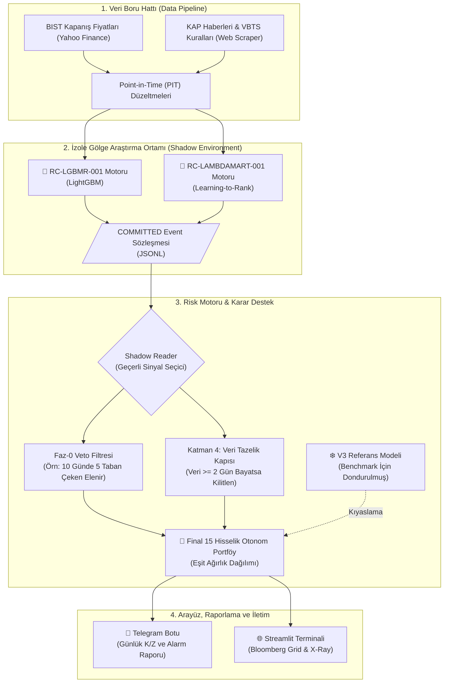

# 🚀 BIST Quant: Gölge Mimari & Otonom Karar Destek Sistemi

[](https://www.python.org/downloads/)
[](https://lightgbm.readthedocs.io/)
[](#)
[](https://streamlit.io/)
[-orange.svg)](https://www.borsaistanbul.com/)
[](LICENSE)
[](#)

> ⚠️ **YASAL UYARI VE KURUMSAL SINIRLAR (İHLAL EDİLEMEZ):**  
> Bu yazılım; Borsa İstanbul pay piyasasında işlem gören hisse senetleri için geliştirilmiş **kantitatif bir araştırma, simülasyon ve Karar Destek Sistemidir (Decision Support System - DSS)**.  
> Sistem **kesinlikle otomatik emir iletmez, canlı sermaye yönetmez ve hiçbir aracı kurum API'sine doğrudan bağlı değildir**. Türkiye SPK lisanssız portföy yöneticiliği mevzuatına %100 uyumludur.

---

## 📌 Yönetici Özeti (Executive Summary)

**BIST Quant**, Borsa İstanbul (BIST 88 evreni) hisse senetlerini analiz etmek, derecelendirmek ve uçtan uca simüle etmek için geliştirilmiş yapay zeka destekli kurumsal bir karar destek motorudur. Geleneksel nominal fiyat tahmininin aksine **Kesitsel Sıralama (Learning-to-Rank)** stratejisi güder.

Proje, geleneksel iç içe geçmiş (monolitik) algoritmaları tamamen terk ederek, dünyanın önde gelen quant fonlarında kullanılan **İleri Yönlü Gölge Altyapı (Forward Shadow Infrastructure)** prensibine geçiş yapmıştır. Bu mimari sayesinde, üretim ortamı (`Streamlit Web UI` ve `Telegram Botu`) arka planda çalışan yapay zeka modellerinden tamamen izole edilmiş, çökmelere ve veri sızıntılarına (data leakage) karşı bağışıklık kazanmıştır.

En son tamamlanan **EXP-MODEL-001** (101 adet regresyon testi) kontrollü mimari deneyleri sonucunda sistem, kilit kutu (lockbox) protokolünü başarıyla geçen **iki yeni nesil Şampiyon Modele** emanet edilmiştir:
1. 🥇 **RC-LGBMR-001 (LightGBM Regression):** Sinyal üreten Birincil Yürütücü Model.
2. 🥈 **RC-LAMBDAMART-001 (LambdaMART):** İkili kıyasla çalışan İkincil Denetleyici Model.

Ayrıca eski jenerasyon **V3 Modeli**, sistemin performansını ve yarattığı alfayı test etmek için üretim ortamında **Dondurulmuş Referans Modeli** (Frozen Reference) olarak korunmakta ve yeni RC (Release Candidate) modelleriyle "Çift Model Kıyaslama" protokolüyle canlı ortamda eşzamanlı dövüştürülmektedir.

---

## 🏗️ Sistem Mimarisi: "Shadow System" (Gölge Yürütme)

Shadow System (Gölge Sistem), modellerin doğrudan işlem yapmasını engeller. Modeller kendi izole ortamlarında çalışıp kararlarını salt okunur bir veri günlüğüne (`JSONL`) basar. Arayüzler bu günlüğü okuyarak çalışır.



---

## 🔬 RC Serisi Şampiyon Modeller ve Faktör Mimarisi

BIST Quant, karmaşık finansal verileri 3 ana fiyat dinamiği (`mom_12_1`, `mom_63`, `vol_63`) üzerinden işleyerek sinyal gürültüsünü filtreler. 4 farklı algoritmanın kapıştırıldığı *EXP-MODEL-001* sürecinde ağaç tabanlı algoritmalar zafer kazanmıştır:

* **RC-LGBMR-001 (Primary):** `max_depth: 4`, `num_leaves: 15` hiperparametreleri ile donatılmış, aşırı uyum (overfitting) tehlikesini sıfıra indiren sığ (shallow) regresyon mimarisi.
* **RC-LAMBDAMART-001 (Secondary):** Hisseleri tek tek değerlendirmek yerine; "A hissesi mi, B hissesi mi?" diyerek evrendeki (cross-section) hisseleri birbiriyle doğrudan dövüştüren ve en iyilerini tepeye iten (`NDCG` maksimizasyonu) ikili kıyas (pairwise) modeli.
* **Sıfır Geleceğe Bakma Hatası (Zero Lookahead Bias):** Tüm eğitim ve geri test işlemleri, katı "Purged Walk-Forward" metodolojisine dayanır. Modeller, gelecekteki verileri asla göremez.

---

## 🛡️ Kantitatif Güvenlik Kalkanları ve Risk Disiplini

Otonom bir modelin kontrolden çıkmasını engellemek için sistemin çekirdeğine 4 farklı güvenlik kalkanı yerleştirilmiştir:

1. **Katman 4 Tazelik Kapısı (Kill-Switch):** Sistemin kullandığı son veri $\ge 2$ gün bayatsa, sistem otomatik kilitlenir. Eski veriyle kesinlikle rebalance (yeniden dengeleme) yapılmaz.
2. **Faz-0 (PASEU Doktrini) Ardışık Taban Vetosu:** Hisse algoritma tarafından #1 sıraya konsa bile, eğer son 10 işlem gününde ciddi çöküş yaşadıysa veya 5 kez taban yaptıysa **sistem o hisseyi doğrudan veto eder.**
3. **%25 Portföy Devre Kesicisi (Max Drawdown Şalteri):** Eğer otonom portföy tüm zamanların en yüksek seviyesinden %25 aşağı düşerse, sistem tamamen nakde geçerek (Risk-Off modu) sermayeyi korumaya alır.
4. **60-Günlük Tutma Disiplini (Çeyreklik Olgunlaşma):** Kurumsal fon mantığına uygun olarak, aşırı al/sat (turnover) maliyetlerini önlemek için portföye alınan bir hisse asgari 60 işlem günü (yaklaşık 1 çeyrek) tutulur. Bu kural sadece acil %20 bireysel stop-loss durumunda kırılır.
5. **Lockbox (Kilit Kutu) Testi:** Yeni bir fikrin sisteme girmesi için 15 aylık, %100 gizli tutulan "Out-of-Sample" dönemini başarıyla geçmesi; P-değeri, Sharpe oranı ve BIST100 getirisini kesin olarak aşması şarttır. (Bkz: `FIRST_WORK_PACKAGE_REPORT.md`)

---

## 🌐 Streamlit Terminali: Modern Bloomberg Grid

`python main.py panel` komutuyla açılan ve tamamen Shadow System (Gölge Sistem) destekli yerel terminal 5 bağımsız yönetim sekmesi sunar:

1. **💼 Canlı Portföy:** Anlık kâr/zarar, 60 günlük asgari tutma süresi takibi ve sermaye eğrisi.
2. **🏆 Otonom Model Sıralaması:** Ana evrendeki hisselerin `RC-LGBMR-001` ve `RC-LAMBDAMART-001` tarafından verilen sıralama (Shadow Rank) kararlarının tam ve interaktif listesi.
3. **🛡️ Sistem Sağlığı & Drift Radarı:** Tazelik kapısı, NaN eksik veri sensörleri ve sistem loglarının canlı denetimi.
4. **👤 Gerçek Portföyüm (İzole Cüzdan):** Kullanıcının kendi gerçek BIST alımlarını kaydettiği, otonom modelden bağımsız, maliyet hesaplayan salt-okunur cüzdan defteri.
5. **🔍 Hisse Röntgeni (Stock X-Ray 2.0):** Herhangi bir hisseyi cerrahi masaya yatıran ikili klinik panel:
   - **Sol Blok (Karne):** Model sırası (Shadow Rank), Görece Alfa ve Faz-0 Risk Durumu.
   - **Sağ Blok (Plotly Teknik Analiz):** Hacim, Mum formasyonları, RSI, SMA 50 çizgileri ve Modelin geçmiş alış fiyatı üzerinden detaylı interaktif grafik.
   - **Özet Rapor:** Tek tıkla Telegram vb. ortamlarda paylaşılabilecek Markdown formatında Hisse Check-Up Raporu oluşturucu.

---

## ⚙️ Kurulum & Merkezi Konsol Kullanımı

### 1. Kurulum (Python 3.11+)

```bash
git clone https://github.com/emreerbasli/bist-quant-ranking.git
cd bist-quant-ranking

# Sanal ortamı (Virtual Environment) kur ve aktifleştir
python -m venv venv
venv\Scripts\activate

# Proje kütüphanelerini yükle
pip install -r requirements.txt
```

### 2. Veri Kaynakları & Mimari Bağımlılıklar
- **Fiyat ve Hacim:** `yfinance` üzerinden günlük oturum sonu BIST verileri (split/temettü düzeltilmiş Point-in-Time).
- **Temel ve VBTS Haberleri:** `BeautifulSoup` ve `requests` ile KAP/BIST duyurularının dinamik taranması.
- **Yapay Zeka Core:** `lightgbm` (Karar Ağaçları ve LambdaMART ranker yapısı), `scikit-learn` (Feature engineering).

### 3. Merkezi Konsol Komutları (`python main.py`)
Tüm sistem operasyonları, kök dizinden çalıştırılan tek bir merkezi CLI dosyası (`main.py`) üzerinden yönetilir:

* 🌐 **`python main.py panel`** → Streamlit Karar Destek Arayüzünü ayağa kaldırır (`http://localhost:8501`).
* 📥 **`python main.py guncelle`** → Günlük BIST kapanış verilerini ve KAP haberlerini günceller.
* ⚡ **`python main.py kontrol`** → Gölge sinyalleri (Shadow events) tarar, portföy durumunu günceller ve Telegram bildirimini tetikler.
* 🛡️ **`python main.py dogrula`** → Veri bütünlüğü ve bulaşma (data leakage) denetimini yapar.
* ⏰ **`python main.py oto`** → Arka plan zamanlanmış (Schedule) otomasyon servisini başlatır.
* 🏛️ **`python main.py`** → Argüman verilmediğinde kullanıcı dostu interaktif konsol menüsünü çalıştırır.

*(Alternatif olarak Windows kullanıcıları kök dizindeki `WEB_PANEL.bat`, `VERI_GUNCELLE.bat`, `GUNLUK_TARAMA.bat` gibi tek tıkla çalıştırılabilen hazır kısayolları da kullanabilirler.)*

---

## 🛑 Kurumsal Hafıza: Reddedilen Stratejiler

Bilimsel geliştirme sürecinde test edilmiş ancak **alfayı yok ettiği veya istatistiksel çöküşe neden olduğu** için kod tabanına eklenmesi kesin olarak yasaklanan metotlar:

| Yasaklanan Fikir | Test Edilen Senaryo | Sonuç ve Red Gerekçesi |
|:---|:---|:---|
| **Bireysel Stop-Loss (TP/SL)** | 25 farklı marjda deneme | BIST hisselerindeki %5-%7 arası olağan "silkeleme" hareketlerine kurban oldu, Sharpe oranını kalıcı olarak yıktı. |
| **Aylık Rotasyon (H=20g)** | Portföyü her 20 günde 1 yenileme | Yıllık işlem hacmi (turnover) %400'ü aştı, komisyon/spread (makas) maliyetleri modelin ürettiği alfanın tümünü eritti. |
| **V5 (Neutral/DART Mimari)** | Hedef nötralizasyonu ve faktör saçılımı | Takip hatasını (tracking error) azalttı ancak endeksle aşırı korele olarak aktif alfayı (Information Ratio) sıfırladı. |
| **V6 (Monotonic Constraints)** | Faktörlere katı yön sınırlamaları konuldu | Modelin esnekliğini bozarak Maximum Drawdown (Zirveden Çöküş) riskini artırdı. |
| **Canlı Broker API İletimi** | Aracı kuruma otomatik al/sat yollama | Türkiye piyasasındaki derinlik sorunları, taban serileri ve regülatif sınırlar nedeniyle sistem sadece Karar Destek aracı kalacaktır. |

---

## 📜 Lisans

Bu proje, açık kaynaklı [MIT Lisansı](LICENSE) altında lisanslanmıştır.  
Arka plandaki model seçimi test raporları, `Lockbox` tutanakları ve kantitatif veri dökümleri için projedeki `research/results/` dizinini inceleyebilirsiniz.
