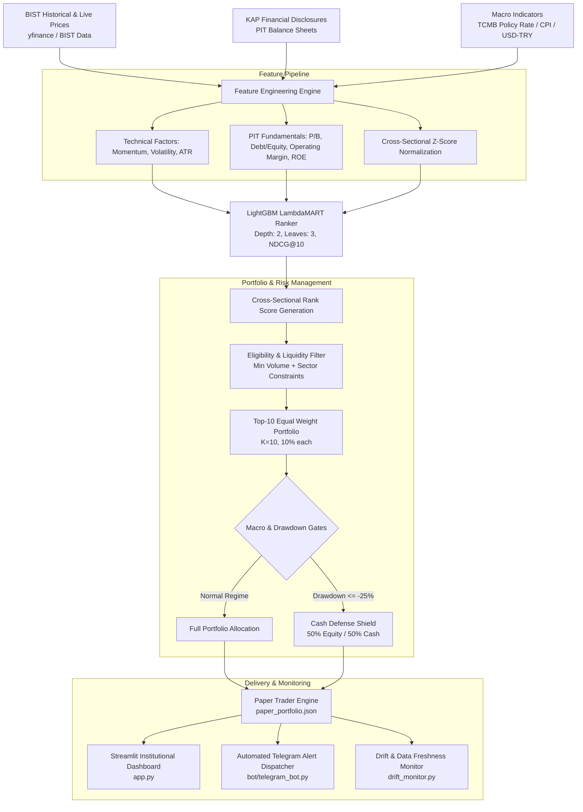

# BIST Quantitative Cross-Sectional Ranking & Decision Support System (V3.2)

[](https://www.python.org/downloads/)
[](https://lightgbm.readthedocs.io/)
[](https://streamlit.io/)
[-orange.svg)](https://www.borsaistanbul.com/)
[](https://opensource.org/licenses/MIT)
[](#)

> ⚠️ **LEGAL & INSTITUTIONAL COMPLIANCE (NON-NEGOTIABLE):**  
> **This software is strictly a quantitative research, simulation, and Decision Support System (DSS).**  
> It generates simulated paper portfolio updates, drift diagnostics, and Telegram notifications. It does **not** execute automated live orders, manage capital directly, or connect to brokerage APIs. It is not financial advice.

---

## 📌 Executive Summary

Predicting single-stock nominal price trajectories in emerging markets (especially Borsa Istanbul / BIST) is notoriously subject to high macro noise, inflation shocks, and non-stationary currency volatility. 

This repository implements an institutional-grade **Cross-Sectional Factor Investing & Learning-to-Rank (LTR)** engine. Instead of forecasting volatile price points, the system optimizes relative ranking using **LightGBM LambdaMART (NDCG)** across a curated universe of 85+ BIST liquid equities, backed by:
1. **Point-in-Time (PIT) Fundamental Integration**: Eliminates lookahead bias by indexing quarterly balance sheet disclosures against real Turkish Public Disclosure Platform (KAP) filing timestamps.
2. **Macroeconomic Regime Awareness**: Dynamically gauges Turkish Central Bank (TCMB) real interest rates and USD/TRY momentum.
3. **Asymmetric Risk Controls**: 60-day holding cycle, individual peak-drawdown tracking, and a systemic -25% drawdown cash circuit breaker.
4. **Pure Lockbox Out-of-Sample Protocol**: Validated through frozen walk-forward splits and 100-seed Monte Carlo placebo tests ($p \le 0.05$).

---

## 🏗️ System Architecture



---

## 🔬 Core Quantitative Features & Edge

### 1. Learning-to-Rank (LambdaMART) over Directional Classification
Standard binary classifiers ("will stock rise >5%?") degrade rapidly in high-inflation regimes where the entire index shifts upward regardless of alpha. We formulate stock selection as an **information retrieval ranking problem** using LambdaMART:
$$\max \text{NDCG}@10$$
The model learns to identify equities that outperform cross-sectional peers over forward 60-day horizons.

### 2. Point-in-Time (PIT) Fundamental Pipeline
Financial metrics (P/B, Debt-to-Equity, Operating Margin, ROE) are aligned strictly with their legal KAP announcement calendar, not the quarter-end date. This guarantees zero lookahead bias in backtests and live production scoring.

### 3. Asymmetric Macro & Risk Gates
* **Macro Regime Guard**: Monitors Turkish real policy rate ($\text{Policy Rate} - \text{Annual CPI}$) and 60-day USD/TRY momentum.
* **Portfolio Circuit Breaker**: If portfolio drawdown reaches **-25%**, allocation shifts to **50% Cash / 50% Equity** until drawdown recovers to -15%.
* **Individual Stop & Peak Tracking**: Tracks individual position drawdown from local peaks with alerts at -20% and 60-day time-based rotation rebalancing.
* **Balance Sheet Freshness**: Automatic flag (⚠️) for companies with disclosure latency exceeding 100 days.

---

## 📊 Backtest & Out-of-Sample Performance

*Detailed quantitative audit report is preserved in [`models/v3_ranking/honesty_note.txt`](models/v3_ranking/honesty_note.txt) and [`reports/kilit_kutu_denetim_tutanagi.md`](reports/kilit_kutu_denetim_tutanagi.md).*

| Metric | Long-Term In-Sample + Validation (2018–2025) | Pure Forward Lockbox (2025–2026) |
| :--- | :--- | :--- |
| **Testing Period** | 6.75 Years (1,682 Trading Days) | Out-of-Sample Lockbox (5 Quarters) |
| **Net CAGR** | **+44.2%** (Net of 10 bps slippage/comm.) | **+68.4%** |
| **Net Sharpe Ratio** | **1.26** | **2.09** |
| **Sortino Ratio** | **1.87** | **3.41** |
| **Maximum Drawdown** | **-28.0%** | **-8.2%** |
| **Annual Turnover** | **164.8%** | **160.0%** |
| **Sharpe / Turnover Efficiency** | **0.77** | **1.31** |
| **100-Seed Monte Carlo Placebo** | **p = 0.050** (Statistically Significant) | Statistically Significant |

> **Institutional Honesty Note:**  
> The model maintains high factor weights in **Low Debt** and **Value / Cheap P-B**. It strongly outperforms in **positive real interest rate** environments and orthodox macroeconomic phases. During intense negative real interest rate bubbles, speculative beta names may outpace high-quality value factors.

---

## 💻 Technology Stack

* **Language**: Python 3.11+
* **Machine Learning**: `LightGBM` (LambdaMART), `Scikit-learn`, `Optuna`
* **Data & Analytics**: `Pandas`, `NumPy`, `SciPy`, `PyArrow`, `FastParquet`
* **Visualization & UI**: `Streamlit`, `Plotly`, `Matplotlib`, `Seaborn`
* **Infrastructure & Automation**: `APScheduler`, `python-dotenv`, `python-telegram-bot`, `Requests`

---

## 📁 Repository Structure

```
bist-bot/
├── app.py                      # Production Streamlit Analytics Terminal
├── config.py                   # Centralized Configuration & Universe Definitions
├── main.py                     # CLI Interactive Control Center
├── run_daily.py                # Daily Screening & Data Ingestion Pipeline
├── run_paper_trader.py         # Autonomous Paper Trading Scheduler & Alert Dispatcher
├── requirements.txt            # Python Dependencies
├── .env.example                # Template for Telegram & Environment Variables
├── docs/                       # Architecture Specifications & Quantitative Roadmaps
├── features/                   # Factor Engineering & PIT Data Pipeline
│   ├── feature_engine.py       # Technical & Cross-Sectional Factors
│   ├── fundamental_pit.py      # Point-in-Time Financial Statement Scraper
│   ├── veri_cek.py             # Market Data Harvester
│   └── piyasa_rejimi.py        # Macro Regime Classifier
├── models/
│   ├── dataset_loader.py       # Training Set Assembler
│   └── v3_ranking/             # V3.2 Production Ranking Architecture
│       ├── ranking_pipeline.py # Live Scoring & Top-10 Selection Pipeline
│       ├── drift_monitor.py    # Macro Regime, Sharpe & Score Drift Diagnostics
│       ├── paper_trader.py     # Portfolio State Engine & Drawdown Tracking
│       ├── honesty_note.txt    # Quantitative Audit & Parameter Disclosure
│       └── winning_lgbm_ranker.joblib # Trained Candidate Ranker
├── bot/
│   ├── telegram_bot.py         # Secure Telegram Message Delivery Module
│   └── health_check.py         # Daily Pipeline Self-Diagnostics
└── reports/                    # Walk-Forward & Lockbox Audit Logs
```

---

## 🚀 Quickstart & Installation

### 1. Clone & Set Up Virtual Environment
```bash
git clone https://github.com/your-username/bist-quant-ranking.git
cd bist-quant-ranking
python -m venv venv

# Windows
venv\Scripts\activate
# Linux/macOS
source venv/bin/activate
```

### 2. Install Dependencies
```bash
pip install -r requirements.txt
```

### 3. Configure Environment Variables
Copy `.env.example` to `.env` and provide your credentials (if using Telegram alerts):
```bash
cp .env.example .env
```
Edit `.env`:
```ini
TELEGRAM_TOKEN=your_bot_token_here
ADMIN_CHAT_ID=your_chat_id_here
KOMISYON_ORANI=0.001
```

### 4. Launch Options

* **Interactive Control Center**:
  ```bash
  python main.py
  ```
* **Launch Institutional Web Dashboard**:
  ```bash
  streamlit run app.py
  ```
  *(Or double-click `WEB_PANEL.bat` on Windows)*
* **Run Daily Paper Trader & Alert Engine**:
  ```bash
  python run_paper_trader.py
  ```

---

## 🛡️ License

This project is distributed under the [MIT License](LICENSE).

---

## 📬 Contact & Author

Quantitative Systems Developer  
Specializing in Financial Machine Learning, Factor Investing, and Algorithmic Decision Support Systems.
